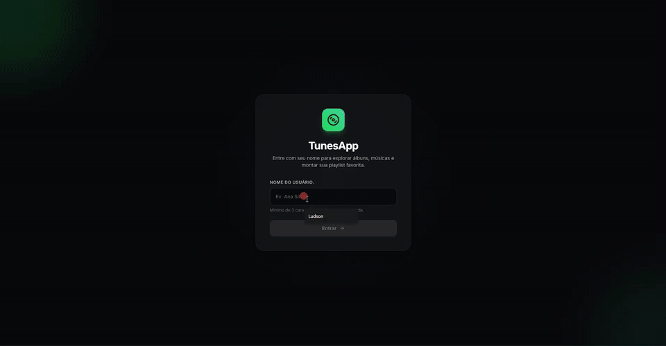
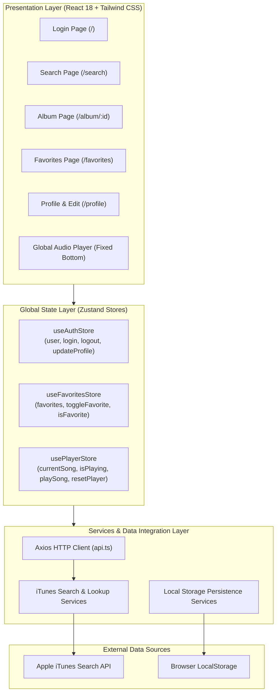

# 🎧 TunesApp Pro

[](https://reactjs.org/)
[](https://www.typescriptlang.org/)
[](https://tailwindcss.com/)
[](https://zustand-demo.pmnd.rs/)
[](https://axios-http.com/)
[](https://vitejs.dev/)
[](https://vitest.dev/)
[](https://opensource.org/licenses/MIT)

> 🇧🇷 [**Versão em Português**](README.md) | 🇺🇸 **English**

**TunesApp Pro** is a modern and responsive music discovery and streaming web application built with React 18, TypeScript, and Tailwind CSS. The app interfaces with the official iTunes Search API to deliver real-time discography searches, persistent audio playback via a global player, reactive favorites management powered by Zustand, and user profile persistence.

## 📌 Quick Navigation

- [📝 About the Project](#-about-the-project)
- [🖼️ Preview](#️-preview)
- [🌐 Live Deployment](#-live-deployment)
- [⚡ API Endpoints](#-api-endpoints)
- [✨ Features](#-features)
- [🛠️ Technologies & Tools Used](#️-technologies--tools-used)
- [🏛️ Solution Architecture](#️-solution-architecture)
- [📁 Repository Structure](#-repository-structure)
- [💡 Technical Decisions](#-technical-decisions)
- [🚀 How to Run the Project](#-how-to-run-the-project)
- [📄 License](#-license)

## 📝 About the Project

**TunesApp Pro** was architected to demonstrate modern front-end best practices and engineering patterns. Geared towards high performance and seamless user experience (UX), the project incorporates:

1. **Decoupled & Reactive Architecture:** Application state is partitioned into isolated stores using **Zustand**, enabling background music playback to continue undisturbed across page transitions.
2. **End-to-End Strict Typing:** Complete entity and response modeling (albums, songs, iTunes API contracts, user profile) using **TypeScript 5**, eliminating runtime bugs and guaranteeing maintainability.
3. **Dark Mode Design System:** Engineered from the ground up with **Tailwind CSS**, inspired by leading music streaming platforms, featuring optimistic UI updates, skeleton states, smooth micro-interactions, and comprehensive mobile/desktop responsiveness.

## 🖼️ Preview

<div align="center">
  
</div>

## 🌐 Live Deployment

Access the deployed application:
👉 **[TunesApp Pro](https://tunesapp.vercel.app/)**

## ⚡ API Endpoints

The application consumes services from the official **iTunes Search API** through a tailored **Axios** client configured with custom timeouts, automatic response mapping, and strict TypeScript contracts:

| Operation | Method | Base Endpoint / Path | Key Parameters | Description |
| :--- | :---: | :--- | :--- | :--- |
| **Search Albums** | `GET` | `https://itunes.apple.com/search` | `entity=album&term={artist}&attribute=allArtistTerm` | Fetches the collection of all albums matching the searched artist |
| **Lookup Album Tracks** | `GET` | `https://itunes.apple.com/lookup` | `id={collectionId}&entity=song` | Retrieves album metadata and tracklist with 30-second audio preview URLs |
| **User Persistence** | `LOCAL` | Storage Client (`userAPI.ts`) | `name, email, image, description` | Handles user authentication state and profile updates in async `localStorage` |
| **Favorites Persistence** | `LOCAL` | Storage Client (`favoriteSongsAPI.ts`) | `Song { trackId, trackName, previewUrl... }` | Manages favorited tracks with optimistic updates and local syncing |

## ✨ Features

- **Authentication & Session:**
  - Streamlined login experience with reactive validation (minimum 3 characters required).
  - Explicit **Logout** functionality (accessible via Top Header and Profile page) that clears credentials, resets stores, and halts active audio playback.
- **Artist Exploration & Search:**
  - Real-time catalog search by artist or band name.
  - Responsive artwork grid with automated high-resolution image upscaling (dynamically converting 100x100 thumbnails to 400x400 - 600x600 assets).
  - Track count indicators, metadata badges, and smooth hover scale effects.
- **Detailed Album View:**
  - Hero header with high-resolution cover art, total tracks, artist name, and release year.
  - Complete tracklist table with individual playback triggers and quick preview.
- **Persistent Global Audio Player:**
  - Fixed bottom player bar that continues playing without interruption when navigating across routes.
  - Controls for play/pause, animated progress pulse, track details, and instant toggle for favorited state.
- **Personal Favorites Playlist:**
  - Optimistic UI updates when favoriting/unfavoriting tracks (zero lag or latency).
  - Dedicated page to browse saved tracks with live item count and fast removal.
- **Profile Customization:**
  - Verified account banner with customizable avatar, contact email, and user biography.
  - Form editor with live image preview and validation constraints.

## 🛠️ Technologies & Tools Used

| Layer / Purpose | Technology | Description |
| :--- | :--- | :--- |
| **Primary Language** | **TypeScript 5.7** | Robust static typing for API contracts, global state stores, and UI components |
| **User Interface Library** | **React 18.3** | Modern functional components leveraging Hooks (`useState`, `useEffect`, `useRef`) |
| **Build Tool & Bundler** | **Vite 6.1** | Lightning-fast development server, instant HMR, and optimized production builds |
| **Styling & Design System** | **Tailwind CSS 3.4** | Utility-first styling with custom dark theme, glassmorphism, and responsive design |
| **Global State Management** | **Zustand 5.0** | Minimalist, unopinionated reactive state stores for Auth, Favorites, and Audio Playback |
| **HTTP Client** | **Axios 1.7** | Centralized client instance with typed responses and timeout handling |
| **Client-Side Routing** | **React Router Dom 5.3** | Declarative SPA navigation (`/`, `/search`, `/album/:id`, `/favorites`, `/profile`) |
| **Iconography** | **Lucide React 0.47** | Clean, pixel-perfect vector icons across the entire user journey |
| **Test Runner & Engine** | **Vitest 3.0** | Ultra-fast unit and integration testing engine powered by Vite |
| **Component Testing** | **Testing Library & jsdom** | Behavior-driven component testing simulating genuine user actions |

## 🏛️ Solution Architecture



## 📁 Repository Structure

```text
tunes-pro/
├── public/                     # Static assets and web app manifest
│   ├── favicon.svg             # Vector favicon with neon gradient & audio equalizers
│   └── manifest.json           # Web application manifest
├── src/
│   ├── components/             # Reusable UI components
│   │   ├── GlobalPlayer.tsx    # Fixed bottom bar with continuous HTML5 audio playback
│   │   ├── Header.tsx          # Sticky top bar with navigation, user state, and logout
│   │   └── MusicCard.tsx       # Tracklist rows with audio controls and favorite heart toggles
│   ├── pages/                  # Main route views
│   │   ├── Album.tsx           # Selected album overview and song collection
│   │   ├── Favorites.tsx       # User's personal favorited tracks
│   │   ├── Login.tsx           # Authentication gateway
│   │   ├── NotFound.tsx        # Customized 404 error page
│   │   ├── Profile.tsx         # User profile presentation card
│   │   └── ProfileEdit.tsx     # Profile modification and avatar preview form
│   ├── services/               # HTTP client and persistent storage modules
│   │   ├── api.ts              # Custom Axios instance configured for iTunes
│   │   ├── favoriteSongsAPI.ts # Local persistent repository for favorites
│   │   ├── musicsAPI.ts        # Album track lookup endpoint caller
│   │   ├── searchAlbumsAPI.ts  # Artist discography search caller
│   │   └── userAPI.ts          # User credentials and session storage handler
│   ├── store/                  # Zustand global state slices
│   │   ├── useAuthStore.ts     # User authentication and profile state
│   │   ├── useFavoritesStore.ts# Favorites state with optimistic mutations
│   │   └── usePlayerStore.ts   # Continuous audio player state and controls
│   ├── tests/                  # Automated test suite (Vitest + RTL)
│   │   ├── components/         # Component behavior tests (MusicCard)
│   │   ├── pages/              # End-to-end integration tests (Login, Search)
│   │   ├── stores/             # Unit tests for Zustand store logic
│   │   └── setup.ts            # Test environment polyfills & setup
│   ├── types/                  # Central TypeScript declarations
│   │   └── index.ts            # Core entities: Album, Song, User, ITunesRaw
│   ├── App.tsx                 # Route declarations and root layout orchestration
│   ├── index.css               # Tailwind CSS directives and custom scrollbar
│   └── main.tsx                # React 18 createRoot entry point
├── index.html                  # Vite HTML entry file
├── package.json                # Project dependencies and operational scripts
├── postcss.config.js           # PostCSS Tailwind processor config
├── tailwind.config.js          # Design system color and theme configuration
├── tsconfig.json               # Strict TypeScript compiler options
└── vite.config.ts              # Vite bundler and Vitest test runner configuration
```

## 💡 Technical Decisions

1. **Migration from Create React App to Vite:** Create React App is officially deprecated and exhibited strict dependency issues with Node 20+. Vite was chosen for its native ES modules architecture, lightning-fast compilation, and instant Hot Module Replacement (HMR).
2. **Refactoring from Class Components to Functional Components & TypeScript:** The initial codebase relied on legacy React classes. Migrating to functional components with Hooks combined with TypeScript eliminates subtle lifecycle bugs, guarantees type safety across API boundaries, and simplifies state flow.
3. **Zustand over Redux:** For a streaming web application, Zustand offers lightweight state management without redundant boilerplate (no action types, dispatchers, or reducers), allowing state sharing across routes with zero performance penalty and continuous background audio playback.
4. **Centralized HTTP Client with Axios:** Encapsulating network calls into a configured Axios instance ensures predictable timeouts, simplified JSON response handling, and straightforward test mocking.
5. **Vitest as the Primary Test Runner:** Powered by the same compilation pipeline as Vite, Vitest provides out-of-the-box ESM support, TypeScript parsing, and cuts execution times by over 70% compared to traditional Jest setups.

## 🚀 How to Run the Project

### Prerequisites
- **Node.js** (version 18 or higher)
- **npm**, **yarn**, or **pnpm**

### Step-by-Step

1. Clone this repository:
```bash
git clone https://github.com/Ludson96/project-trybe-tunes.git
cd project-trybe-tunes
```

2. Install dependencies:
```bash
npm install
```

3. Launch the development server:
```bash
npm run dev
```
The application will be accessible at `http://localhost:5173`.

4. Execute the automated test suite with Vitest:
```bash
npm run test
```

5. Run TypeScript type checking and build for production:
```bash
npm run build
```

## 📄 License

This project is open source and available under the **MIT License**. See the [LICENSE](LICENSE) file for more information.

<div align="center">
  Developed by <strong>Ludson Pereira dos Santos</strong> 🚀<br />
  <a href="https://www.linkedin.com/in/ludson96/">LinkedIn</a> • <a href="https://github.com/ludson96">GitHub</a> • <a href="mailto:ludson_ps27@hotmail.com">Email</a>
</div>
