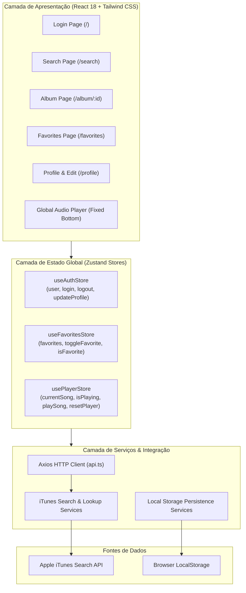

# 🎧 TunesApp Pro

[](https://reactjs.org/)
[](https://www.typescriptlang.org/)
[](https://tailwindcss.com/)
[](https://zustand-demo.pmnd.rs/)
[](https://axios-http.com/)
[](https://vitejs.dev/)
[](https://vitest.dev/)
[](https://opensource.org/licenses/MIT)

> 🇧🇷 **Português** | 🇺🇸 [**English Version**](README.en.md)

O **TunesApp Pro** é uma plataforma moderna e responsiva de streaming e descoberta musical construída com React 18, TypeScript e Tailwind CSS. A aplicação integra-se à API oficial do iTunes Search para fornecer busca instantânea de discografias, reprodução contínua de áudio via player global, gerenciamento reativo de faixas favoritas com Zustand e edição de perfil de usuário com persistência.

## 📌 Navegação Rápida

- [📝 Sobre o Projeto](#-sobre-o-projeto)
- [🖼️ Preview](#️-preview)
- [🌐 Deploy da Aplicação](#-deploy-da-aplicação)
- [⚡ API Endpoints](#-api-endpoints)
- [✨ Funcionalidades](#-funcionalidades)
- [🛠️ Tecnologias e Ferramentas Utilizadas](#️-tecnologias-e-ferramentas-utilizadas)
- [🏛️ Arquitetura da Solução](#️-arquitetura-da-solução)
- [📁 Estrutura do Repositório](#-estrutura-do-repositório)
- [💡 Decisões Técnicas](#-decisões-técnicas)
- [🚀 Como Executar o Projeto](#-como-executar-o-projeto)
- [📄 Licença](#-licença)

## 📝 Sobre o Projeto

O **TunesApp Pro** foi projetado para demonstrar padrões arquiteturais modernos do ecossistema front-end contemporâneo. Focado em alta performance e experiência de usuário (UX) fluida, o projeto implementa:

1. **Arquitetura Desacoplada e Reativa:** O estado global da aplicação é particionado em stores independentes com **Zustand**, permitindo que o player de áudio permaneça tocando ininterruptamente durante toda a navegação do usuário.
2. **Tipagem Estrita de Ponta a Ponta:** Toda a modelagem de entidades (álbuns, músicas, respostas do iTunes, perfis de usuário) utiliza **TypeScript 5**, reduzindo riscos em tempo de execução e assegurando excelente manutenibilidade.
3. **Design System Dark Mode:** Interface construída do zero com **Tailwind CSS**, inspirada nas principais plataformas de áudio globais, com feedback otimista, skeletons, micro-animações e compatibilidade completa com mobile e desktop.

## 🖼️ Preview

<div align="center">
  
</div>

## 🌐 Deploy da Aplicação

Acesse a aplicação em produção:
👉 **[TunesApp Pro](https://tunesapp.vercel.app/)**

## ⚡ API Endpoints

A aplicação consome os serviços oficiais da **iTunes Search API** por meio de um cliente **Axios** configurado com timeout, parsing automático e tipagem estrita de contratos:

| Operação | Método | Endpoint Base / Rota | Parâmetros Principais | Descrição |
| :--- | :---: | :--- | :--- | :--- |
| **Buscar Álbuns** | `GET` | `https://itunes.apple.com/search` | `entity=album&term={artist}&attribute=allArtistTerm` | Retorna a coleção completa de álbuns associados ao artista pesquisado |
| **Listar Faixas do Álbum** | `GET` | `https://itunes.apple.com/lookup` | `id={collectionId}&entity=song` | Retorna metadados do álbum e a lista de faixas com URL de prévia de áudio |
| **Persistência de Usuário** | `LOCAL` | Storage Client (`userAPI.ts`) | `name, email, image, description` | Gerencia a sessão e perfil do usuário no `localStorage` assíncrono |
| **Persistência de Favoritas** | `LOCAL` | Storage Client (`favoriteSongsAPI.ts`) | `Song { trackId, trackName, previewUrl... }` | Salva e sincroniza as músicas curtidas com mutação otimista |

## ✨ Funcionalidades

- **Autenticação & Sessão:**
  - Login simplificado com validação reativa (mínimo de 3 caracteres).
  - Encerramento de sessão com o botão **Sair da conta** (no Header e no Perfil), que desloga o usuário, limpa credenciais e pausa qualquer reprodução em andamento.
- **Exploração e Pesquisa de Artistas:**
  - Busca rápida de discografias completas por nome de banda ou cantor.
  - Grade responsiva com capas tratadas em alta resolução (resolução dinâmica de 400x400 a 600x600).
  - Exibição da quantidade de faixas por álbum e efeitos de escala e transição no hover.
- **Visualização Detalhada do Álbum:**
  - Capa em destaque, contagem de faixas, artista e ano de lançamento.
  - Tracklist completa com botões de play e audição rápida.
- **Player Global Contínuo:**
  - Barra de áudio fixa no rodapé que nunca interrompe a reprodução quando o usuário troca de rota.
  - Controles de reproduzir/pausar, indicação visual de progresso e atalho para favoritar a faixa tocando.
- **Playlist de Músicas Favoritas:**
  - Sistema de favoritar com atualização otimista (feedback visual instantâneo sem travamentos).
  - Tela dedicada para gerenciar faixas curtidas com contador dinâmico.
- **Gerenciamento de Perfil:**
  - Exibição de avatar, e-mail, biografia e status da conta.
  - Tela de edição com prévia do avatar em tempo real e validação de formulário.

## 🛠️ Tecnologias e Ferramentas Utilizadas

| Camada / Finalidade | Tecnologia | Descrição |
| :--- | :--- | :--- |
| **Linguagem Principal** | **TypeScript 5.7** | Tipagem estática rigorosa para contratos da API, estados globais e componentes |
| **Biblioteca de Interface** | **React 18.3** | Componentes funcionais modernos utilizando Hooks (`useState`, `useEffect`, `useRef`) |
| **Ferramenta de Build & Bundler** | **Vite 6.1** | Inicialização ultrarrápida, Hot Module Replacement (HMR) e compilação otimizada |
| **Estilização & Design System** | **Tailwind CSS 3.4** | Estilização utilitária com tema Dark customizado, responsividade fluida e glassmorphism |
| **Gerenciamento de Estado Global** | **Zustand 5.0** | Lógica de estado reativa e descentralizada para Auth, Favoritos e Player contínuo |
| **Cliente HTTP** | **Axios 1.7** | Instância centralizada com tipagem de responses, tratamento de timeouts e erros |
| **Roteamento SPA** | **React Router Dom 5.3** | Navegação declarativa entre rotas (`/`, `/search`, `/album/:id`, `/favorites`, `/profile`) |
| **Conjunto de Ícones** | **Lucide React 0.47** | Ícones vetoriais modernos, limpos e consistentes em toda a aplicação |
| **Testes Automatizados** | **Vitest 3.0** | Suíte de testes unitários e de integração de altíssima velocidade |
| **Testes de Componentes** | **Testing Library & jsdom** | Testes de comportamento de UI simulando interações reais de usuários |

## 🏛️ Arquitetura da Solução



## 📁 Estrutura do Repositório

```text
tunes-pro/
├── public/                     # Ativos estáticos e PWA Manifest
│   ├── favicon.svg             # Favicon vetorial com gradiente neon e tema áudio
│   └── manifest.json           # Manifesto da aplicação
├── src/
│   ├── components/             # Componentes de interface compartilhados
│   │   ├── GlobalPlayer.tsx    # Player fixo no rodapé com áudio HTML5 persistente
│   │   ├── Header.tsx          # Barra superior de navegação, status e logout
│   │   └── MusicCard.tsx       # Lista de faixas com play direto e checkbox de favoritos
│   ├── pages/                  # Telas e páginas principais
│   │   ├── Album.tsx           # Visualização do álbum selecionado e tracklist
│   │   ├── Favorites.tsx       # Playlist de músicas curtidas
│   │   ├── Login.tsx           # Tela inicial de autenticação
│   │   ├── NotFound.tsx        # Página 404 personalizada
│   │   ├── Profile.tsx         # Visualização dos dados do perfil
│   │   └── ProfileEdit.tsx     # Edição dos dados e foto de perfil
│   ├── services/               # Clientes HTTP Axios e adaptadores de armazenamento
│   │   ├── api.ts              # Instância configurada do Axios
│   │   ├── favoriteSongsAPI.ts # Repositório local de músicas favoritas
│   │   ├── musicsAPI.ts        # Consulta de faixas de álbum no iTunes
│   │   ├── searchAlbumsAPI.ts  # Busca de discografia por artista no iTunes
│   │   └── userAPI.ts          # Persistência de perfil e logout de sessão
│   ├── store/                  # Gerenciamento de estado global com Zustand
│   │   ├── useAuthStore.ts     # Estado da sessão e do perfil do usuário
│   │   ├── useFavoritesStore.ts# Estado das músicas favoritas
│   │   └── usePlayerStore.ts   # Estado do player contínuo e reprodução
│   ├── tests/                  # Suíte de testes automatizados (Vitest)
│   │   ├── components/         # Testes de componentes (MusicCard)
│   │   ├── pages/              # Testes de integração (Login, Search)
│   │   ├── stores/             # Testes unitários das stores Zustand
│   │   └── setup.ts            # Polyfills e ambiente de execução de testes
│   ├── types/                  # Definições de tipos e interfaces TypeScript
│   │   └── index.ts            # Entidades centrais: Album, Song, User, ITunesRaw
│   ├── App.tsx                 # Configuração de rotas e orquestração da aplicação
│   ├── index.css               # Diretivas do Tailwind CSS e scrollbar customizada
│   └── main.tsx                # Ponto de montagem React 18 createRoot
├── index.html                  # Ponto de entrada HTML do Vite
├── package.json                # Dependências e scripts do projeto
├── postcss.config.js           # Processador de estilos CSS
├── tailwind.config.js          # Configuração de tema e extensão de cores Tailwind
├── tsconfig.json               # Configuração do compilador TypeScript
└── vite.config.ts              # Configuração do Vite e Vitest
```

## 💡 Decisões Técnicas

1. **Migração do Create React App para Vite:** O Create React App encontra-se descontinuado e apresentava incompatibilidades severas com ecossistemas Node 20+. O Vite foi adotado por oferecer compilação baseada em ES modules, compilação de assets sob demanda e suporte de primeira classe ao TypeScript e Vitest.
2. **Substituição de Class Components por Hooks & TypeScript:** O código original utilizava componentes em classe e prop-types em JavaScript. A refatoração completa para componentes funcionais traz clareza de fluxo, facilidade de composição e elimina potenciais vazamentos de memória durante atualizações de ciclo de vida.
3. **Adoção do Zustand em Detrimento do Redux:** Para uma aplicação SPA focada em streaming, o Zustand entrega desacoplamento entre UI e lógica de negócio sem a verbosidade de reducers e actions do Redux tradicional, além de viabilizar a arquitetura do player contínuo sem re-renderizações desnecessárias da árvore de componentes.
4. **Camada HTTP Centralizada com Axios:** O uso de instâncias configuradas do Axios garante timeouts controlados, tipagem automática dos retornos JSON e facilidade para mockar requisições nos testes automatizados.
5. **Vitest como Engine de Testes:** Executado diretamente pelo mesmo pipeline do Vite, o Vitest reduz o tempo de execução da suíte de testes em mais de 70% em comparação com executores baseados em Jest, compartilhando as mesmas configurações de compilação.

## 🚀 Como Executar o Projeto

### Pré-requisitos
- **Node.js** (versão 18 ou superior)
- **npm**, **yarn** ou **pnpm**

### Passo a Passo

1. Clone este repositório:
```bash
git clone https://github.com/Ludson96/project-trybe-tunes.git
cd project-trybe-tunes
```

2. Instale todas as dependências:
```bash
npm install
```

3. Inicie o servidor em modo de desenvolvimento:
```bash
npm run dev
```
O console exibirá o endereço local, geralmente disponível em `http://localhost:5173`.

4. Execute a suíte de testes automatizados com Vitest:
```bash
npm run test
```

5. Verifique a tipagem TypeScript e gere o bundle de produção:
```bash
npm run build
```

## 📄 Licença

Este projeto é distribuído sob a licença **MIT**. Consulte o arquivo [LICENSE](LICENSE) para obter detalhes completos.

<div align="center">
  Desenvolvido por <strong>Ludson Pereira dos Santos</strong> 🚀<br />
  <a href="https://www.linkedin.com/in/ludson96/">LinkedIn</a> • <a href="https://github.com/ludson96">GitHub</a> • <a href="mailto:ludson_ps27@hotmail.com">E-mail</a>
</div>
